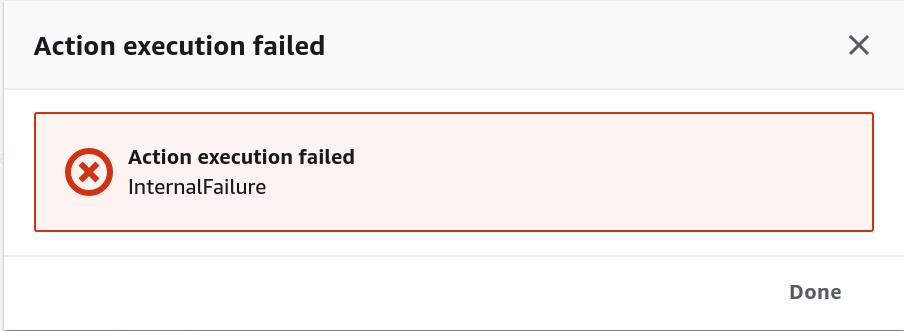

Personal website homepage.

- 2015 Originally a J2EE application hosted on google app engine.

- 2016 Converted to AWS elasticbeanstalk (basically lift and shift)

- 2017 Converted to statically hosted s3 bucket where the access point was cloudfront

- 2020 Refactoring to get all (or at least most) resources into cloudformation now that you can import resources that were not originally created in cloudformation.
    - Adding a CI/CD code pipeline to accomplish this


### CloudFormation Limitations

#### Deploying Stack Updates from CodePipeline
CloudFormation is a best practice that allows you to
define your aws resources as code.

Unfortunately I did not always use CloudFormation and it really came back to haunt me when refactoring my webpage to accomdate a more test driven development style.

The AWS re:Invent 2019 announcement to allow you to import existing resources not backed by cloudformation templates to be [imported into cloudformation](https://docs.aws.amazon.com/AWSCloudFormation/latest/UserGuide/resource-import.html) is a great opportunity for refactoring.

One issue I wanted to document is that if the stack you imported has some drift detected after the import, the code pipeline deploy stage will not provide an intuitive error message



I am unsure if this generic InternalFailure error was because the stack was in IMPORT_COMPLETE status and had the drift present in the stack is the or just any stack with drift cannot be updated via a Deploy ActionTypeID in Code Pipeline.

Best practice going forward will be to ensure all stacks do not have any drift when being updated by a CodePipeline Stage.

#### DeletionPolicy attribute must be string
[According to this forum post](https://forums.aws.amazon.com/message.jspa?messageID=560586)
The DeletionPolicy must be a string, this limits flexibility when trying to pass it as a parameter dependent on environment...

### Development Tooling Overview

Followed [this aws example](https://forums.aws.amazon.com/thread.jspa?threadID=228206) on how to have multiple rsa key pairs in the same local machine being used with different accounts

#### cfn-lint (cloudformation Linting)
[cfn-lint](https://github.com/aws-cloudformation/cfn-python-lint.git) Provides yaml/json cloudformation validation and checks for best practices

- Install

```
    pip install cfn-lint
```

- Run on a file
```
    cfn-lint <filename.yml>

    cfn-lint templates/code_pipeline.yml
```

- Run on all files in Directory
```
    cfn-lint templates/*.yml
```


#### Git Secrets Scan

[git secrets](https://github.com/awslabs/git-secrets.git) is a command line utility for validating that you do not have any git credentials stored in your git repo commit history

This is useful for not only open source projects, but also to make sure best practices are being followed with limited duration credentials (IAM roles) instead of long term access keys

- Global install

```
    git init

    git remote add origin https://github.com/awslabs/git-secrets.git

    git fetch origin

    git merge origin/master

    sudo make install
```

- Web Hook install

Configuring git secrets as a web hook will ensure that git secrets runs on every commit, scanning for credentials
```
    cd ~/Documents/devdocs

    git secrets --install

    git secrets --register-aws
```


- Run a git secrets check recursively on all files in directory

```
git secrets --scan -r .
```


### Project Directory Overview
Provides information on each directory/ source file

#### builds

##### py
    Directory for custom python scripts that setup build configuration


##### Buildspec Files
- buildspec_dev.yml = Buildspec to use for the development (QA)
    CodeBuild project

- buildspec_prod.yml = Buildspec to use for the prod deployment CodeBuild project

#### docs


#### devops

##### images
Repository for images that relate to resources for our code pipeline

#### legacy
awscli bash scripts used to import existing resources into
cloudformation templates.

Since the website implementation was originally created outside of
cloudformation

[List of resources that can be imported into cloudformation](
    https://docs.aws.amazon.com/AWSCloudFormation/latest/UserGuide/resource-import-supported-resources.html
    )

##### Prepare Existing CloudFront for migration

Documenting various one-time setup procedures that
were required when creating a new cloudfront distribution
via cloudformation because cloudformation resource import
does not support cloudfront

Get the existing CloudFront Distribution config via
the cli:

```
aws cloudfront get-distribution-config
--id <distribution_id> > distribution_config_backup.json
```

Change the default and max ttl as you prepare to
change the distribution

#### logs
- directory for python log files


#### templates


Who the user is allowed to pass the role to is limited by
the [iam:PassedToService condition](https://docs.aws.amazon.com/IAM/latest/UserGuide/reference_policies_examples_iam-passrole-service.html)


Note: stacks that were never initially created successfully can
only be deleted and recereated when in [ROLLBACK_COMPLETE state](https://stackoverflow.com/a/36550496)


- code_pipeline.yml = Creates CodeBuild/Code Pipeline resources
    necessary for Dev/Prod


#### tests

#### web
Static html/js/css hosted in the s3 bucket

#### Setup Continuous Integration

Add the remote repo using the following:
```
git init

git remote add origin <origin_url_or_ssh>

```


Fetch origin repo locally and merge if the remote

has any references you do not

```
    git fetch origin

    git merge origin/<branch_name>
```


#### Setup Infrastructure
